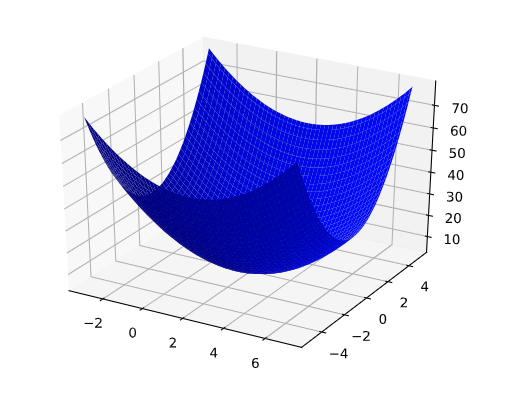

# 数学知识

#### 矢量

在数学和物理学中，矢量是一个有大小和方向的量。矢量通常用箭头表示，箭头的长度表示矢量的大小，箭头的方向表示矢量的方向。

矢量可以在不同的数学和科学领域中有不同的定义和应用。以下是一些常见的矢量的例子：

1. **几何矢量：** 在几何学中，矢量通常表示为一个有向线段。例如，从点A指向点B的箭头就可以表示为几何矢量。
2. **物理矢量：** 在物理学中，速度、加速度、力等量都是矢量，因为它们除了有大小之外还有方向。例如，一个速度矢量可能表示一个物体以一定的速度向东移动。
3. **线性代数中的列矢量：** 在线性代数中，矢量可以表示为一个列矢量，其中元素按照顺序排列。例如，列矢量 [1,2,3] 表示三维空间中的一个点的坐标。
4. **计算机图形学中的位移矢量：** 在计算机图形学中，矢量通常用于表示平移、旋转等变换操作。例如，一个二维平移矢量[*dx*,*dy*] 可以表示在水平方向上平移 *dx*个单位，在竖直方向上平移 *dy* 个单位。

矢量的运算包括加法、减法、数量乘法等，这些运算可以通过将矢量的各个分量逐一进行相应的操作来完成。矢量在物理、工程、计算机科学等领域中都有广泛的应用。

#### 梯度下降算法

梯度下降法是一种优化算法，用于最小化（或最大化）一个函数，特别是在机器学习和深度学习中用于调整模型的参数以减小损失函数。以下是梯度下降法的基本算法步骤：

1. **初始化参数：** 随机或根据经验设定模型参数的初始值。

2. **计算损失函数的梯度：** 计算当前模型参数对应的损失函数关于每个参数的偏导数（梯度）。梯度表示了损失函数在当前参数值处的变化率和方向。

3. **更新参数：** 沿着梯度的反方向调整模型参数，以减小损失函数。更新规则通常为：

   *θ*=*θ*−*α*⋅∇*J*(*θ*)

   其中，*θ* 是模型参数，*α* 是学习率，∇*J*(*θ*) 是损失函数关于参数的梯度。

4. **重复：** 重复步骤2和步骤3，直到损失函数收敛到一个最小值，或达到预定的迭代次数。

梯度下降法有不同的变体，主要区别在于参数的更新方式。两种主要的变体是：

- **批量梯度下降（Batch Gradient Descent）：** 在每一次迭代中，使用整个训练数据集来计算梯度和更新参数。
- **随机梯度下降（Stochastic Gradient Descent）：** 在每一次迭代中，随机选择一个样本来计算梯度和更新参数。这样的方法更加高效，尤其对于大规模数据集。
- **小批量梯度下降（Mini-Batch Gradient Descent）：** 是上述两者的折中，每一次迭代中使用一个小批量的样本来计算梯度和更新参数。

学习率的选择、收敛条件的判定以及梯度的计算都是需要仔细调整和优化的参数，以确保算法的有效性和稳定性。

#### 偏导数和梯度

##### 偏导数

**多变量函数**指的是具有多个参数的函数，例如：

$$
f(x,y) = e^{2y}sin(x)
$$
对x的*f*偏导数，表示如下：
$$
\frac {\delta f} {\delta x}
$$

是$f$（仅视作$x$的函数）的导数。如需找到以下内容：
$$
\frac {\delta f} {\delta x}
$$
必须保持$y$恒定不变（因此$f$现在是单变量的函数$x$），并取$f$相对于$x$的常规导数。例如，当$y$固定为1时，前面的函数就变成：
$$
f(x) = e^2sin(x)
$$
其导数为：$e^2cos(x)$

一般来说，假设$y$固定，$f$对$x$的偏导数的计算公式如下：

$$
\frac {\delta f} {\delta x}(x, y) = e^{2y}cos(x)
$$
同理，如果我们设定$x$固定值，$f$对$y$的偏导数为：
$$
\frac {\delta f} {\delta y}(x, y) = 2e^{2y}sin(x)
$$
直观地说，偏导数可以让您知道当您略微变动一个变量时函数的变化幅度。在前面的示例中：
$$
\frac {\delta f} {\delta x}(0,1) = e^2 ≈ 7.4
$$
因此，当您从 (0,1)开始，保持$y$恒定不变并稍微移动$x$时，$f$变化量会是变化量的 7.4 倍左右$x$。

在机器学习中，偏导数主要与函数的梯度结合使用。

##### 渐变\梯度

函数的**梯度**是偏导数相对于所有自变量的矢量，表示如下：
$$
\Delta f
$$
例如，如果：
$$
f(x,y) = e^{2y}sin(x)
$$
则：
$$
\Delta f(x,y) = (\frac {\delta f}{\delta x}(x,y), \frac{\delta f}{\delta y}(x, y))  = (e^{2y}cos(x), 2e^{2y}sin(x))
$$

> 注意：
>
> $\Delta f$指向函数增长最快的方向。
>
> $-\Delta f $指向函数下降最快的方向。

该矢量中的维度个数等于$f$公式中的变量个数；换言之，该矢量位于该函数的域空间内。例如，函数$f(x,y) = 4 + (x-2)^2 + 2y^2$的图表在三维空间中使用$z=f(x,y)$看起来就像一个山谷，最小值为(2,0,4)。

$f(x,y)$的梯度是一个二维矢量，可以了解到$(x,y)$向哪个方向移动，高度增加的最大幅度。因此，渐变的负值就是向着高度降低的最大方向移动。换言之，矢量的负值指向山谷。

在机器学习中，梯度用于梯度下降法。在尝试最小化的许多变量中，经常会有一个损失函数，为此，我们会尝试跟踪函数梯度的负值。
