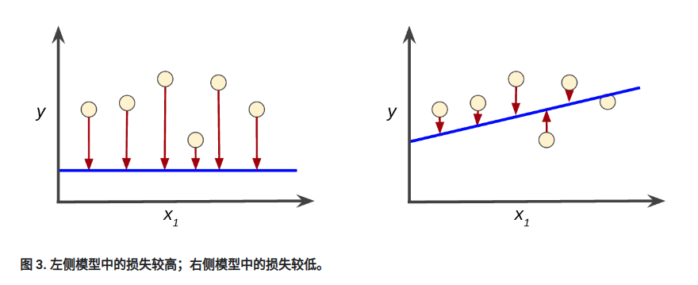
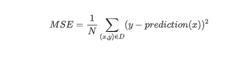
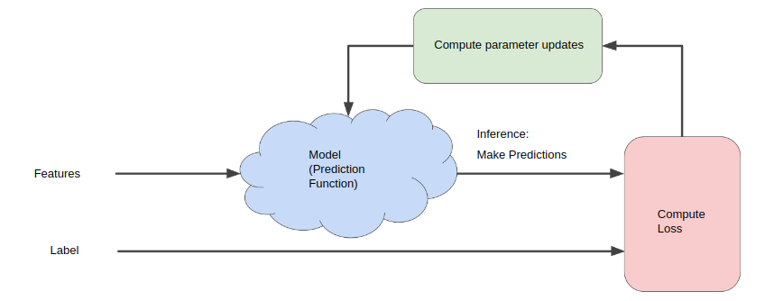
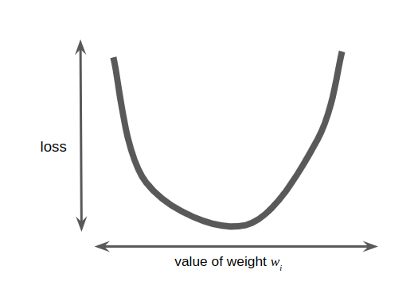
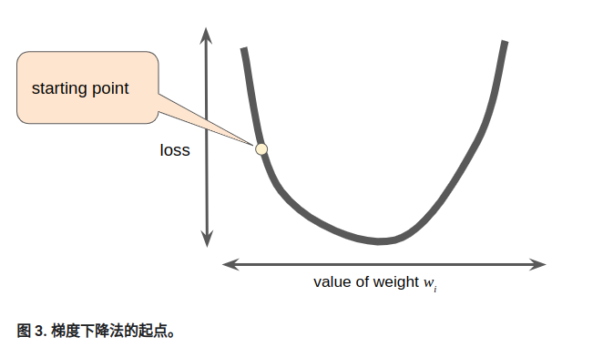
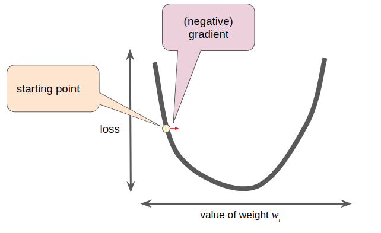
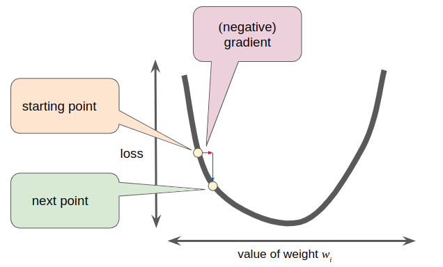
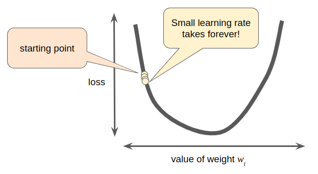
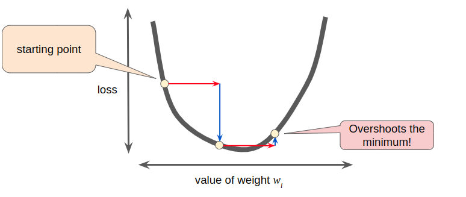

# 机器学习

https://developers.google.com/machine-learning?hl=zh-cn

#### 前提条件

###### Numpy框架

###### Pandas框架

#### 主要机器学习语言

##### 标签

**标签**是指我们要预测的内容，即简单线性回归中的 `y` 变量。标签可以是小麦的未来价格、图片中显示的动物类型、音频剪辑的含义，也可以是其他任何信息。

##### 特征

**特征**是输入变量，即简单线性回归中的 `x` 变量。一个简单的机器学习项目可能会使用单个功能，而更复杂的机器学习项目可以使用数百万个功能。

##### 样本

**样本**是指数据的特定实例：**x**。（我们将 **x** 显示为粗体，表示它是一个矢量。）

> 矢量：[点这里](./pic/数学知识.md#矢量)

我们将示例分为两类：

- 有标签样本
- 无标签样本

###### 有标签样本

**有标签样本**同时包含特征和标签。具体来说：

```python
  labeled examples: {features, label}: (x, y)
```

###### 无标签样本

**无标签样本**包含特征，但不包含标签。具体来说：

```
  unlabeled examples: {features, ?}: (x, ?)
```

> 使用有标签样本训练模型后，我们便会使用该模型来预测无标签样本的标签。

##### 模型

模型定义了特征和标签之间的关系。例如，垃圾内容检测模型可能会将某些功能与“垃圾内容”紧密关联。我们重点介绍模型生命周期的两个阶段：

###### 训练

- **训练**是指创建或**学习**模型。也就是说，您向模型展示有标签样本，让模型逐渐学习特征与标签之间的关系。

###### 推断

- **推断**表示将经过训练的模型应用于无标签样本。也就是说，使用经过训练的模型做出有用的预测 (`y'`)。

##### 回归与分类

###### 回归模型

**回归**模型可预测连续值。例如，回归模型做出的预测可回答如下问题：

- 加利福尼亚州一栋房子的价值是多少？
- 用户点击此广告的可能性有多大？

###### 分类模型

**分类**模型可预测离散值。例如，分类模型做出的预测可回答如下问题：

- 指定的电子邮件是垃圾邮件还是非垃圾邮件？
- 这是狗、猫还是仓鼠的图片？


#### 线性回归

*y' = b + w<sub>1</sub>x<sub>1</sub>*

- *y'*是预测的标签，是理想输出。
- *b*是偏差，有时称*w<sub>0</sub>*。
- *w<sub>1</sub>*是特征1的权重。权重与传统方程中的斜率相同。
- *x<sub>1</sub>*是一项功能（已知输入）。

> 更复杂的模型可能依赖于多个特征，每个特征都有单独的权重（w<sub>1</sub>, w<sub>2</sub>等）


#### 训练和损失

训练模型只需从有标签样本中学习（确定）所有权重和偏差的理想值。在监督式学习中，机器学习算法通过检查许多示例并尝试找到将损失降至最低的模型来构建模型；此过程称为经验风险最小化。

##### 损失

损失是错误预测的惩罚。也就是说，**损失**是一个表示模型在单个样本上的预测质量的数字。如果模型的预测完全准确，则损失为零，否则损失会更大。训练模型的目的是从所有样本中找到一组平均损失“较小”的权重和偏差。例如，图 3 左侧显示的是高损失模型，右侧显示的是低损失模型。对于该图，请注意以下几点：

- 箭头表示损失。
- 蓝线表示预测。



> 您可能想知道是否可以创建数学函数（损失函数），以有意义的方式汇总各个损失。

###### <span id="损失函数">平均损失函数</span>

我们在此探讨的线性回归模型使用一种称为**平方损失函数**（也称为 **L<sub>2</sub> 损失**）的损失函数。

***(y - y')<sup>2</sup>***

**均方误差** (**MSE**) 是指整个数据集中每个样本的平均平方损失。如需计算 MSE，请先计算各个样本的所有平方损失之和，然后除以样本数量：



其中：

- (x, y) 是一个示例，其中
  - x 是模型用于进行预测的特征集（例如，年龄、性别）。
  - y 是示例标签（例如，温度）。
- *prediction(x)* 是权重和偏差与一组特征的组合x。
- D 是一个包含多个有标签样本（成对）的数据集。(x, y)
- N是D中的样本数。

> 虽然 MSE 常用于机器学习，但它既不是唯一实用的损失函数，也不是适用于所有情况的最佳损失函数。
>


#### 降低损失

##### 迭代方法

下图展示了机器学习算法用于训练模型的迭代试错过程：



“模型”将一个或多个特征作为输入，并返回一项预测作为输出。为简单起见，假设一个模型接受一个特征 (x<sub>1</sub>) 并返回一个预测 (y′)：

*y' = b + w<sub>1</sub>x<sub>1</sub>*

我们应该为 b和 x<sub>1</sub>设置哪些初始值？对于线性回归问题，事实证明起始值并不重要。我们可以选择随机值，但采用下面这些无关紧要的值:

- b = 0
- w<sub>1</sub> = 0

假设第一个特征值是 10。将该特征值插入到预测函数中可产生：

y' = 0 + 0 * 10 = 0

图中的“计算损失”部分是模型将使用的[损失函数](#损失函数)。假设我们使用平方损失函数，就会得出损失函数的值，然后机器学习系统会根据所有标签重新评估所有特征，为损失函数生成一个新值，而该值又产生新的参数值。学习过程会持续迭代，直到该算法发现损失可能最低的模型参数。通常，您可以反复迭代，直到整体损失不再发生变化或变化速度至少变化得非常缓慢。这时候，我们可以说该模型已**收敛**。


##### 梯度下降

> 迭代方法中包含一个标题为“计算参数更新”的华而不实的绿色方框。我们现在要用更实质的方法代替这种精明的算法。

假设我们有时间和计算资源来计算 w<sub>1</sub>的所有可能值的损失。对于我们一直在研究的那类回归问题，产生的损失与 w<sub>1</sub> 的图表始终是凸形。换句话说，图表将始终是碗状图，如下所示：



凸形问题只有一个最小值；即只有一个位置的斜率正好为 0。这个最小值就是损失函数收敛的位置。

通过计算整个数据集内每个可能的 w<sub>1</sub>值的损失函数来寻找收敛点的效率非常低下。我们来研究一种更好的机制，这种机制在机器学习领域非常热门，称为**梯度下降法**。

梯度下降法的第一阶段是为 w<sub>1</sub>选择一个起始值（起点）。起点并不重要；因此，许多算法直接将 w<sub>1</sub> 设置为 0 或选择随机值。在下图中，我们选择了一个略大于 0 的起点：



然后，[梯度下降算法](./pic/数学知识.md#梯度下降算法)会计算损失曲线在起点的梯度。在图 3 中，损失的梯度等于曲线的导数（斜率），可以告诉您哪个方向是“更暖”还是“冷”。当有多个权重时，**梯度**是偏导数相对于权重的矢量。

[点击了解偏导数和梯度](./pic/数学知识.md#偏导数和梯度)

> TensorFlow 会处理所有梯度计算，因此实际上不必了解此处提供的微积分。

梯度始终指向损失函数中增长最显著的方向。梯度下降法朝着负梯度方向前进，以便尽快减少损失。



为了确定损失函数曲线上的下一个点，梯度下降法算法会将梯度大小的一部分添加到起点，如下图所示：




然后，梯度下降法会重复此过程，接近最小值。

##### 学习速率

如上所述，梯度矢量同时具有方向和大小。梯度下降法算法会将梯度乘以称为“学习速率”（有时也称为“步长”）的标量，以确定下一个点。例如，如果梯度大小为 2.5 且学习速率为 0.01，则梯度下降法算法会选择距离前一个点 0.025 的下一个点。

###### 超参数

**超参数**是编程人员在机器学习算法中用于调整的旋钮。大多数机器学习程序员都会花费大量时间来调整学习速率。如果您选择的学习速率过小，则学习将会花费太长时间：



相反，如果您指定的学习速率过大，则下一个点将永远在井底随意弹跳，就像量子力学实验大错一样：



每个回归问题都存在一个[金发姑娘](https://wikipedia.org/wiki/Goldilocks_principle)学习速率。“金发姑娘”值与损失函数的平坦程度有关。如果您知道损失函数的梯度较小，则可以放心地尝试较大的学习速率，以抵消小的梯度，从而产生较大的步长。

###### 理想的学习速率

一维空间的理想学习速率是$\frac {1}{f''(x)}$（f(x)对x的二次导数的逆）。

二维或多维空间中的理想学习速率是[海森矩阵](https://wikipedia.org/wiki/Hessian_matrix)（二阶偏导数的矩阵）的倒数。

广义凸函数的情况则更加复杂。

##### 随机梯度下降法

在梯度下降法中，**批次**是用于在单次训练迭代中计算梯度的一组样本。到目前为止，我们假定该批次是整个数据集。在 Google 的规模下，数据集通常包含数十亿甚至数千亿个样本。此外，Google 数据集通常包含大量特征。因此，一个批次可能非常庞大。超大的批量也可能会导致单次迭代就可能需要很长时间才能完成计算。

**随机梯度下降法** (**SGD**) 将这种想法运用到极致，它每次迭代只使用一个样本（批次大小为 1）。如果有足够的迭代，SGD 可以正常工作，但噪声非常嘈杂。术语“随机”表示构成每个批次的一个样本是随机选择的。

**小批量随机梯度下降法**（**小批量 SGD**）是介于全批量迭代与 SGD 之间的折衷方案。小批次通常包含 10 到 1,000 个随机选择的样本。小批量 SGD 可以减少 SGD 中的噪声数，但仍然比全批量更高效。

###### 随机梯度下降法

随机梯度下降法（Stochastic Gradient Descent，简称SGD）是一种优化算法，用于训练机器学习模型，特别是在大规模数据集上。与传统的梯度下降法不同，SGD每次更新模型参数时仅使用一个样本（或一小批样本），而不是整个数据集。

以下是随机梯度下降法的基本步骤：

1. **初始化参数：** 为模型参数设置初始值，可以随机选择或使用某种启发式方法。

2. **随机选择样本：** 从训练数据集中随机选择一个样本（或一小批样本）。

3. **计算梯度：** 对选定的样本计算损失函数相对于模型参数的梯度。这是损失函数对每个参数的偏导数。

4. **更新参数：** 使用梯度信息来更新模型参数。更新规则通常形式为： 
   $$
   \theta = \theta - \eta\Delta J(\theta)
   $$
   其中，*θ*是模型参数，*η*是学习率，∇*J*(*θ*)是损失函数对参数的梯度。

5. **重复迭代：** 重复执行步骤2至步骤4，直到满足停止条件，例如达到预定的迭代次数或损失函数收敛到某个阈值。

由于SGD每次只使用一个样本（或一小批样本），它的更新过程具有一定的随机性，这有助于跳出局部极小值并更快地收敛到全局极小值。然而，由于随机性，SGD可能会引入一些噪声，因此可能需要调整学习率等超参数以实现良好的性能。

除了标准的SGD，还有一些改进的变体，如Mini-batch SGD和Momentum SGD，它们在实际应用中更为常见，以平衡计算效率和模型性能。

